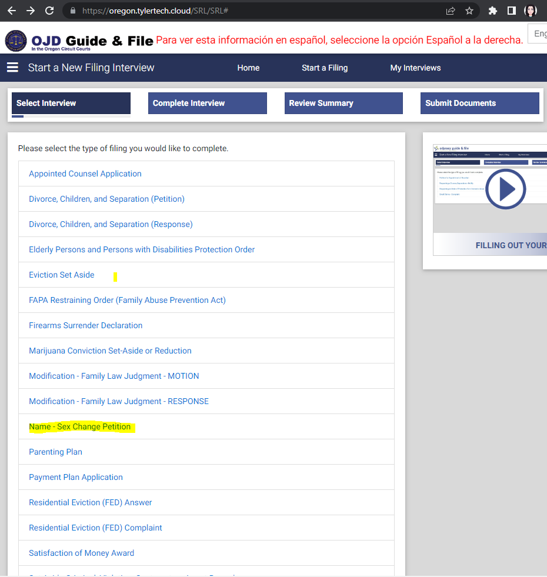
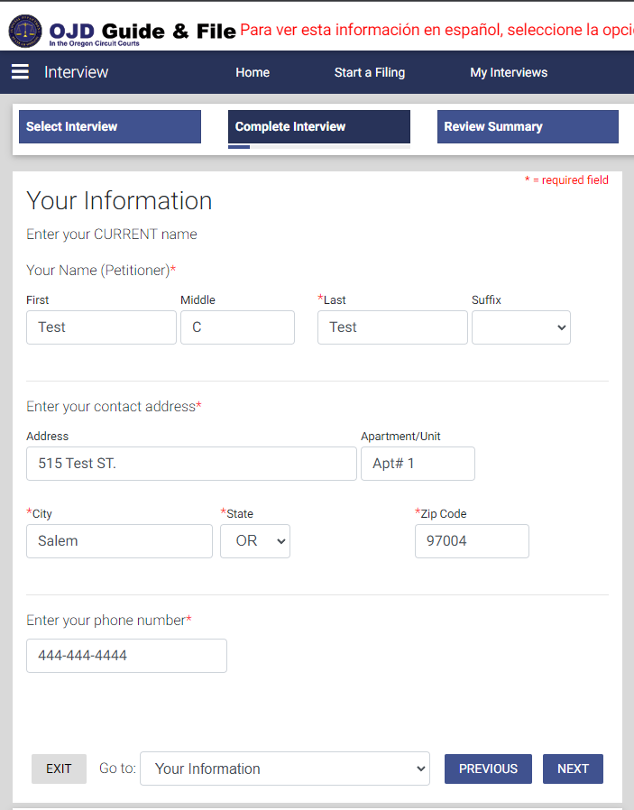
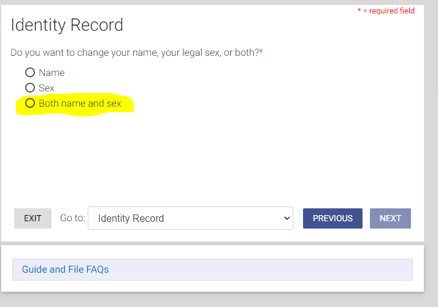
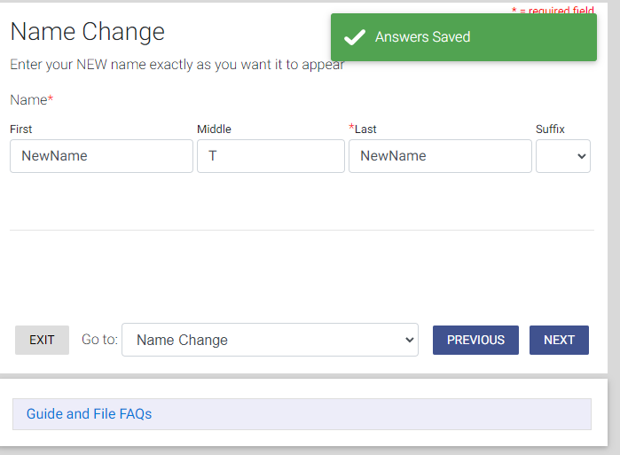
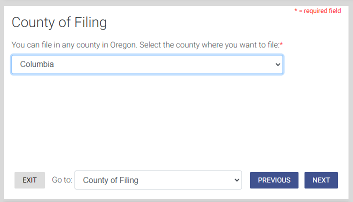
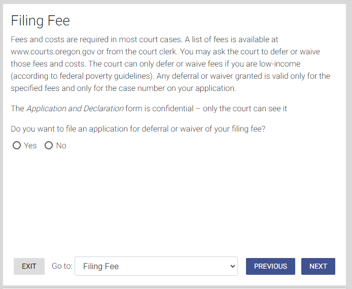

# How to EFile your name change in Oregon

In this guide I will show you how to efile your name change in the state of oregon. This makes the process of getting a name change and gender identity change in Oregon much more approachable and simple.

To efile a name change you will first need an online account for OJD eFile. This is an online system that allows you to file various different legal cases in the state of Oregon. To sign up for a ODJ eFile account please go [here](https://www.courts.oregon.gov/services/online/pages/efile.aspx) and follow the instructions on the page. Once you have this account setup and are logged in we are ready to start. Below are the step by step instructions for eFiling your name change.

Next go to [OJD Guide & File](https://oregon.tylertech.cloud/SRL/SRL). This site will walk you through the steps needed to prepare your case for filing on the OJD efile system.

Once you have registered for an OJD eFile account and are at have navigated to the link in the paragraph above, complete the following steps:

1. From the filing type list please select Name - Sex Change Petition. This will take you to a landing page with instructions for the form.

2. Read the instructions and then click next. The next page will warn you about your address and email. Read the instructions and press next.
3. Fill out your information.

4. Select Both Name and Sex.

5. Enter your new name exactly as you want it to appear.

6. Fill out Name change Additional Information.

7. Fill out Gender on Sext Change Page.
8. Fillout the form for sealing the record. This will allow your name and gender change to be private and not searchable via public databases.
9.  Select the court you'd like to file in. Typically this will be your local circuit court for your county.

10. You have finished filling out the form. Next it's time to fill out some information about the filling. Click next.
11. Do you want to wave the filing fee?

12. Next, ESign the Forms. Be sure to use your current legal name!
13. Request Certified Copies. You will get one certified copy with the Judgement once it has been executed. However, you may want to consider getting additional copies especially since you are having the case sealed. Additional copies can still be requested at the court house later if you need them.
14. There is a survey at the end of the interview fill it out if you want to.
15. You have completed the form. It's now time to prepare the filing.
16. Review the documents. Make sure to open each of the documents and ensure that everything is correct. If changes need to be made you can go back to earlier steps in the process to make changes. It is also a good idea to download a copy of the documents at this time.
17. Pay the court filling fee.
18. Once  the fee has been paid submit the files to the court.

Congratulations! You have filed for your name and gender change! It will take some time for the court to process your case. Typically it takes a few weeks to a month to get the judgement back from the court. It should come in the mail to the mailing address you put on the filing. If it is taking longer than you thought or something goes wrong you can reach out to your circuit court directly for questions.